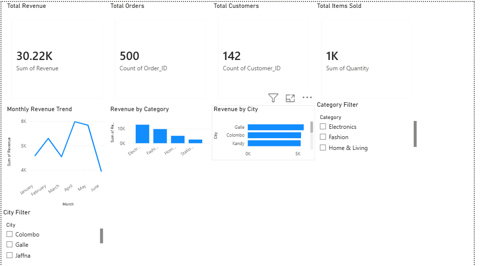

# 📊 E-Commerce Sales Analytics

An end-to-end data analytics project that analyzes e-commerce sales data using Python, SQL, and Power BI to uncover business insights, sales trends, customer behavior, and regional performance.

## 🎯 Project Objective

The objective of this project is to transform raw e-commerce sales data into meaningful business insights through data cleaning, exploratory data analysis, SQL analysis, and interactive dashboard development.

## 🛠️ Technologies Used

- Python
- Pandas
- Matplotlib
- SQL
- SQLite
- Power BI
- Jupyter Notebook
- Git & GitHub

## 🔄 Project Workflow

Raw Sales Data  
↓  
Data Cleaning with Python  
↓  
Exploratory Data Analysis  
↓  
SQL Business Analysis  
↓  
Power BI Dashboard  
↓  
Business Insights

## 📊 Dataset

The dataset contains 500 cleaned sales transactions with information including:

- Order ID
- Order Date
- Customer ID
- City
- Product
- Category
- Quantity
- Unit Price
- Discount
- Payment Method
- Revenue

## 🧹 Data Cleaning

The raw dataset was cleaned using Python and Pandas.

Main cleaning steps included:

- Removing duplicate records
- Handling missing city values
- Converting order dates to datetime format
- Creating a Revenue column
- Validating data types
- Exporting a cleaned dataset for further analysis

## 🔍 Exploratory Data Analysis

Python was used to analyze:

- Total revenue
- Total orders
- Total customers
- Total items sold
- Average order value
- Monthly revenue trends
- Revenue by product category
- Revenue by city
- Top customers
- Payment method performance

## 🗄️ SQL Analysis

SQL queries were created to answer key business questions such as:

- What is the total revenue?
- Which product categories generate the most revenue?
- What are the best-selling products?
- Which cities generate the highest revenue?
- Who are the highest-value customers?
- How does revenue change month by month?
- Which payment methods generate the most revenue?
- What is the average order value?

## 📈 Key KPIs

| KPI | Result |
|---|---:|
| Total Revenue | 30,219.46 |
| Total Orders | 500 |
| Total Customers | 142 |
| Total Items Sold | 1,467 |
| Average Order Value | 60.44 |

## 💡 Key Insights

- Galle generated the highest sales revenue among the analyzed cities.
- April 2026 recorded the highest monthly revenue.
- Customer C147 was the highest-value customer.
- Credit Card generated the highest revenue among payment methods.
- Electronics was one of the strongest-performing product categories.

## 📊 Power BI Dashboard

The interactive Power BI dashboard includes:

- Total Revenue
- Total Orders
- Total Customers
- Total Items Sold
- Monthly Revenue Trend
- Revenue by Category
- Revenue by City
- Category Filter
- City Filter



## 📁 Project Structure

```text
ecommerce-sales-analytics/
│
├── data/
│   ├── ecommerce_sales_raw.csv
│   └── ecommerce_sales_cleaned.csv
│
├── notebooks/
│   ├── 01_data_cleaning.ipynb
│   ├── 02_exploratory_data_analysis.ipynb
│   └── 03_sql_analysis.ipynb
│
├── sql/
│   └── analysis_queries.sql
│
├── dashboard/
│   └── ecommerce_sales_dashboard.pbix
│
├── images/
│   └── dashboard_preview.png
│
├── README.md
├── requirements.txt
└── .gitignore